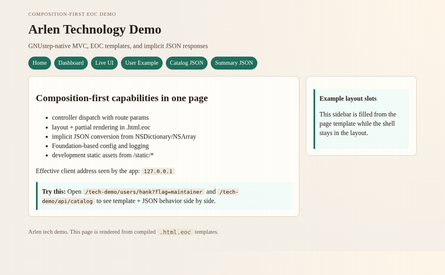

# Arlen

**A batteries-included web framework for Objective-C.**

[](LICENSE)
[](https://github.com/danjboyd/Arlen/releases)
[](https://github.com/danjboyd/Arlen/actions/workflows/linux-quality.yml)
-lightgrey.svg)

Arlen is a free, open-source web framework for Objective-C. It runs natively on
GNUstep (Linux) and the Apple runtime (macOS). It's in the spirit of
Mojolicious and Rails: one coherent toolchain that takes you from
`arlen new` to a supervised production deployment. You don't have to assemble
an HTTP layer from a dozen unrelated libraries.

You get server-rendered HTML with compiled templates, JSON APIs with generated
OpenAPI docs, a PostgreSQL-first data layer, and realtime WebSocket/SSE. Auth
with passkeys and OIDC, admin and job dashboards, and a production process
manager are first-party modules, not plugins you have to vet.

<p align="center">
  
</p>
<p align="center"><sub>The bundled tech demo (<code>./bin/tech-demo</code>): compiled
templates, route params, implicit JSON, and live fragments updating without a
page reload.</sub></p>

## Hello, Arlen

A controller that serves an HTML page and a JSON endpoint:

```objc
@implementation HomeController

// GET / — render an EOC template inside the app layout
- (id)index:(ALNContext *)ctx {
  [self renderTemplate:@"home/index"
               context:@{ @"title" : @"Hello, Arlen",
                          @"items" : @[ @"routing", @"templates", @"JSON" ] }
                 error:NULL];
  return nil;
}

// GET /api/greet/:name — return a dictionary and Arlen renders JSON
- (id)greet:(ALNContext *)ctx {
  return @{ @"hello" : [self stringParamForName:@"name"] ?: @"world" };
}

@end
```

```html
<%@ layout "layouts/main" %>
<h1><%= $title %></h1>
<ul>
  <%@ render "partials/_item" collection:$items as:"item" %>
</ul>
```

EOC templates (`.html.eoc`) compile to Objective-C at build time. Output is
HTML-escaped by default, and template errors report the file and line.

## Quick Start

You need a **clang-built GNUstep toolchain** on Linux, or full Xcode plus
Homebrew `openssl@3` on macOS. `arlen doctor` checks your setup and explains anything that's
missing.

```bash
git clone --recursive https://github.com/danjboyd/Arlen.git
cd Arlen
source tools/source_gnustep_env.sh   # Linux; skip on macOS
./bin/arlen doctor
make all                             # macOS: ./bin/build-apple

# create and run an app
mkdir -p ~/arlen-apps && cd ~/arlen-apps
/path/to/Arlen/bin/arlen new MyApp
cd MyApp
/path/to/Arlen/bin/arlen boomhauer --port 3000
```

Open <http://127.0.0.1:3000/>. Then try `/healthz` and the interactive API
explorer at `/openapi`.

Next, add a route:

```bash
/path/to/Arlen/bin/arlen generate endpoint Hello --route /hello --method GET --template
```

Prefer a single file? `arlen new MyApp --lite` puts the controller, routes, and
`main()` in one `app_lite.m` (see the [Lite Mode Guide](docs/LITE_MODE_GUIDE.md)).

## Start Here

- **[First App Guide](docs/FIRST_APP_GUIDE.md)**: the shortest walkthrough to a real app.
- [Getting Started (Linux)](docs/GETTING_STARTED.md) · [Getting Started (macOS)](docs/GETTING_STARTED_MACOS.md) · [Windows CLANG64 preview](docs/WINDOWS_CLANG64.md)
- [Getting Started Tracks](docs/GETTING_STARTED_TRACKS.md): HTML-first, API-first, or data-layer-first.
- [App Authoring Guide](docs/APP_AUTHORING_GUIDE.md): the long-form guide to building apps.
- [EOC Template Guide](docs/EOC_GUIDE.md) · [Modules](docs/MODULES.md) · [Deployment](docs/DEPLOYMENT.md) · [API Reference](docs/API_REFERENCE.md)
- **Coming from another framework?** See the guides for [Rails](docs/ARLEN_FOR_RAILS.md),
  [Django](docs/ARLEN_FOR_DJANGO.md), [Laravel](docs/ARLEN_FOR_LARAVEL.md),
  [Express/NestJS](docs/ARLEN_FOR_EXPRESS_NESTJS.md), [FastAPI](docs/ARLEN_FOR_FASTAPI.md),
  and [Mojolicious](docs/ARLEN_FOR_MOJOLICIOUS.md).

The [Docs Index](docs/README.md) organizes everything by what you're trying to do.

## Features

| | |
|---|---|
| **HTTP and MVC** | Routing with path params, controllers, middleware, sessions, CSRF, rate limiting, security headers, static files with caching and ranges, multipart uploads |
| **Templates** | EOC (`.html.eoc`) compiled to Objective-C: layouts, partials, collection rendering, forms, auto-escaping, file/line diagnostics; safe Markdown rendering (CommonMark + GFM) |
| **JSON APIs** | Implicit JSON from controller return values, OpenAPI generation, interactive API explorer, JSON-first scaffolds, generated TypeScript clients and validators |
| **Auth** | Passwords, TOTP MFA, recovery codes, passkeys/WebAuthn, OIDC login (including Microsoft Entra), OAuth resource server; headless, stock-UI, or ejected-UI modes |
| **Data** | PostgreSQL-first migrations, schema codegen, typed SQL builder, optional ORM, MSSQL preview, Dataverse client and codegen |
| **Realtime** | WebSocket, SSE, live HTML fragments with a built-in `live.js`, durable event streams with replay |
| **Background work** | Durable PostgreSQL jobs with transactional enqueue, fenced leases, and crash recovery |
| **First-party modules** | `auth`, `admin-ui`, `jobs`, `notifications`, `storage`, `ops`, `search` (PostgreSQL, Meilisearch, OpenSearch), plus an MCP server module |
| **Tooling** | `arlen` CLI for scaffolding, generators, and module management; `arlen doctor`; in-process `ALNTestClient` for app tests |
| **Runtime and deploy** | `boomhauer` dev server with rebuild-on-change; `propane` production manager with worker supervision and graceful reloads; `arlen deploy` with named targets over SSH |

Adding a module takes one command:

```bash
arlen module add auth && arlen module migrate --env development
```

## Why Arlen

- **Native Objective-C, end to end.** Your app is a compiled binary. You keep
  Foundation, ARC, and the language you already know, with no interpreter or
  VM underneath.
- **One framework, not a parts list.** HTML, JSON, auth, jobs, admin, search,
  realtime, and deployment are designed together and tested together.
- **Explicit and deterministic.** Routes are registered in code, templates
  compile to readable Objective-C, and generated code uses stable names. When
  something breaks, the diagnostics point at a file and a line.
- **Free software.** LGPL-2.1-or-later, the same license family as GNUstep
  Base. You can build proprietary apps on Arlen.

**Arlen is probably not for you if** you need a large third-party plugin
ecosystem today, sandboxed or untrusted templates (EOC templates are trusted
code), or a GCC-built GNUstep stack.

## Examples

- [Basic App](examples/basic_app/README.md): the smallest app.
- [API-First Reference](examples/api_reference/README.md): JSON endpoints and OpenAPI.
- [Auth + Admin Demo](examples/auth_admin_demo/README.md): composing the auth and admin modules.
- [Multi-Module Demo](examples/multi_module_demo/README.md): `admin-ui`, `search`, and `ops` together.
- [React/TypeScript Reference](examples/react_typescript_reference/README.md): generated TypeScript contracts with a React frontend.
- [Tech Demo](examples/tech_demo/README.md): the full tour, including live UI. Run `./bin/tech-demo` and open <http://127.0.0.1:3110/tech-demo>.

More examples, covering the ORM, Dataverse, search, and GSWeb migration, live in [`examples/`](examples/).

## Status

Arlen is young but no longer a sketch. The core framework, runtime, and all
first-party modules ship and are covered by required Linux CI with sanitizer
and docs lanes.

| Platform | Status |
|---|---|
| Linux, clang-built GNUstep | **Production baseline.** This is the authoritative target. |
| macOS, Apple runtime | Verified. Recommended for development on a Mac. |
| Windows, CLANG64 | Preview. |

The current release is **v0.1.0**. Arlen follows semantic versioning; while it
is on `0.x`, minor releases may still change public API, with migration notes.
See [Releases](https://github.com/danjboyd/Arlen/releases) and
[docs/RELEASE_NOTES.md](docs/RELEASE_NOTES.md). The capability-level
maturity snapshot (shipped, preview, in flight) is in
[docs/STATUS.md](docs/STATUS.md). Engineering history lives under
[docs/internal/](docs/internal/).

## Community and Contributing

Questions, ideas, and things you've built go in
[GitHub Discussions](https://github.com/danjboyd/Arlen/discussions). Bugs go in
[Issues](https://github.com/danjboyd/Arlen/issues).

Contributions are welcome: bug reports, small reproductions, doc fixes, and
focused patches. [CONTRIBUTING.md](CONTRIBUTING.md) covers toolchain setup,
the test and quality targets, and PR conventions. Report security issues
privately through [SECURITY.md](SECURITY.md). This project follows a
[Code of Conduct](CODE_OF_CONDUCT.md).

## Naming

Arlen and its tools are named after characters from *King of the Hill*:

- `boomhauer` is the development server.
- `propane` is the production manager. All of its settings are called "propane accessories."

## License

Copyright (C) 2026 Daniel Boyd.

Arlen is free software: you can redistribute it and/or modify it under the
terms of the GNU Lesser General Public License as published by the Free
Software Foundation, either version 2.1 of the License, or (at your option) any
later version (LGPL-2.1-or-later), the same license family as GNUstep Base.
See [LICENSE](LICENSE) for the full text.
